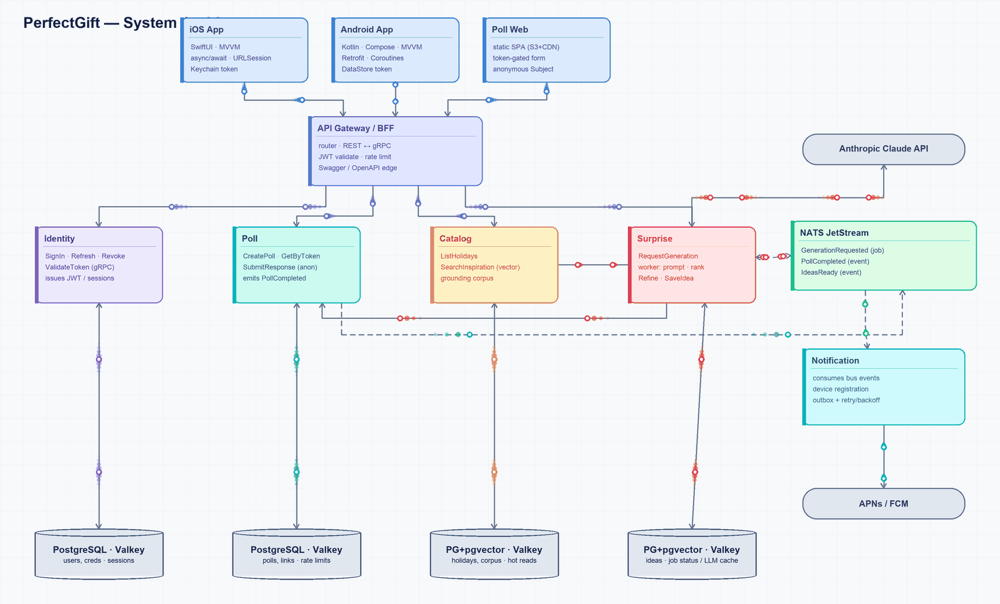

# PerfectGift

**Plan a surprise for your partner** — a date, a gift, a romantic evening — tailored to a
holiday, a budget, and free-form preferences. Its twist is a **two-sided flow**: the *User*
(planner) describes the occasion, and the *Subject* (partner) can secretly answer a short
poll — reached by a shared link or by handing over the phone — whose answers quietly sharpen
the LLM-generated ideas.

Native **iOS** (SwiftUI) and **Android** (Kotlin/Compose) clients, a tiny **poll web page**,
and a set of **Go microservices** behind an API gateway. Idea generation is powered by
**Anthropic Claude**.



> How the components communicate — packets flow along the real links: clients → API gateway
> → domain services → their data stores, the NATS event/job bus, and the external LLM / push
> providers (colored by the calling component).
> Interactive version (pan / zoom / hover-to-trace / click-to-isolate):
> [`diagrams/dependency-graph.html`](diagrams/dependency-graph.html).

---

## Architecture at a glance

Five domain services + an API gateway, an async job/event bus, and boring, well-understood
storage. Full write-up in **[`architecture.md`](architecture.md)**.


- **Edge:** clients speak REST/JSON to the **API Gateway**, which validates JWTs and
  translates to internal **gRPC**.
- **Async:** **NATS JetStream** carries the generation job (`GenerationRequested`) and the
  `PollCompleted` / `IdeasReady` events.
- **Data:** every service owns its **own PostgreSQL** schema (+ **pgvector** for grounding),
  with **Valkey** for sessions/cache/rate-limits. No cross-service DB access.
- **External:** Surprise → Anthropic Claude; Notification → APNs/FCM.

## Services

Each service is self-contained and documented by a `SERVICE.md` (the build-from-scratch
contract) and a `README.md` (how to run it).

### Backend — Go (gRPC internal · HTTP/Swagger edge · Postgres · Valkey · NATS)

| Service | What it does | Docs |
|---|---|---|
| **API Gateway** | Public REST edge; JWT, rate-limits, REST⇄gRPC. Stateless. | [README](services/backend/api-gateway/README.md) · [SERVICE](services/backend/api-gateway/SERVICE.md) |
| **Identity** | Sign-in (Apple/Google/email), JWT issue/validate, JWKS, sessions. | [README](services/backend/identity/README.md) · [SERVICE](services/backend/identity/SERVICE.md) |
| **Poll** | Anonymous, link-scoped two-sided poll flow. Emits `PollCompleted`. | [README](services/backend/poll/README.md) · [SERVICE](services/backend/poll/SERVICE.md) |
| **Surprise** | Async LLM idea generation with grounding. The heart of the product. | [README](services/backend/surprise/README.md) · [SERVICE](services/backend/surprise/SERVICE.md) |
| **Catalog** | Reference data + curated pgvector grounding corpus. | [README](services/backend/catalog/README.md) · [SERVICE](services/backend/catalog/SERVICE.md) |
| **Notification** | APNs/FCM push fan-out with a transactional outbox. | [README](services/backend/notification/README.md) · [SERVICE](services/backend/notification/SERVICE.md) |

### Frontend — three clients, one API

| Client | Stack | Docs |
|---|---|---|
| **iOS** | SwiftUI + MVVM, async/await | [README](services/frontend/ios-app/README.md) · [SERVICE](services/frontend/ios-app/SERVICE.md) |
| **Android** | Kotlin + Jetpack Compose + MVVM | [README](services/frontend/android-app/README.md) · [SERVICE](services/frontend/android-app/SERVICE.md) |
| **Poll Web** | Tiny static SPA (React + Vite) | [README](services/frontend/poll-web/README.md) · [SERVICE](services/frontend/poll-web/SERVICE.md) |

## Quick start (local, Docker)

```bash
cp .env.example .env          # optional: add ANTHROPIC_API_KEY for real generation
make up                       # docker compose up --build -d  (all services + Postgres/Valkey/NATS)
make ps                       # wait for health
```

Then open the gateway Swagger UI at **http://localhost:8080/swagger/**. Full guide, ports,
and troubleshooting in **[`DOCKER.md`](DOCKER.md)**.

A quick end-to-end sanity check through the gateway:

```bash
# sign in (creates the account on first use) → get a token
TOKEN=$(curl -s -X POST localhost:8080/v1/auth/signin -H 'Content-Type: application/json' \
  -d '{"provider":"PROVIDER_EMAIL","email":"you@example.com","password":"hunter2pass"}' \
  | python3 -c 'import sys,json;print(json.load(sys.stdin)["access_token"])')

curl -s localhost:8080/v1/me        -H "Authorization: Bearer $TOKEN"   # your profile
curl -s localhost:8080/v1/holidays  -H "Authorization: Bearer $TOKEN"   # reference data
curl -s -X POST localhost:8080/v1/generations -H "Authorization: Bearer $TOKEN" \
  -H 'Content-Type: application/json' -H 'Idempotency-Key: k1' \
  -d '{"holiday_id":"h1","budget_band":"mid","preferences_text":"loves hiking"}'  # → 202
```

## Tech stack

iOS SwiftUI · Android Kotlin/Compose · static poll SPA · Go (gRPC + HTTP/Swagger) ·
PostgreSQL (+pgvector) · Valkey · NATS JetStream · Anthropic Claude
(`claude-sonnet-5` default, `claude-opus-4-8` premium, `claude-haiku-4-5` moderation) ·
Docker Compose · OpenTelemetry/Prometheus.

## Repository layout

```
architecture.md            the architecture design (start here)
DOCKER.md                  running the whole stack locally
docker-compose.yml         infra + all six services
diagrams/                  system + flow diagrams, dependency visualization
services/
  backend/<service>/       Go microservices (SERVICE.md + README.md each)
  frontend/<client>/       iOS · Android · poll-web
```

## Status

- ✅ **Backend:** all six services build & test green; run together via Docker.
- ✅ **Gateway ⇄ services:** authenticated flows verified end-to-end (sign-in → `/me`,
  holidays, categories, generation `202`, device register).
- ✅ **Frontend:** poll-web (typecheck + tests + build green); iOS core package (`swift build`
  + 30 tests); Android (structurally complete — build needs Android Studio).
- ⏳ **Known gaps:** Poll *owner* routes need Poll's JWT check switched from HS256 to Identity's
  JWKS; generation producing real ideas needs an `ANTHROPIC_API_KEY`; the embedding model must
  be unified between Surprise and Catalog for real semantic grounding.

## Testing it yourself

Every backend service runs `go build ./... && go test ./...` hermetically (external deps behind
fakes). Generated protobuf/gRPC code is regenerated with `make generate` per service (it is
git-ignored). See each service's README for specifics.
