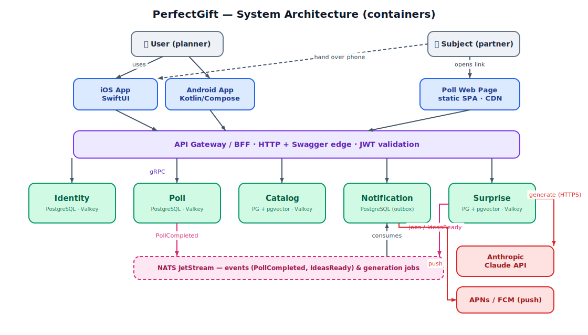
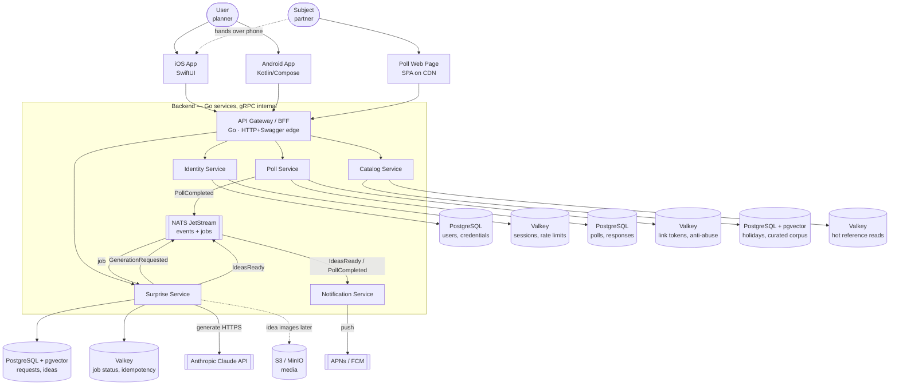
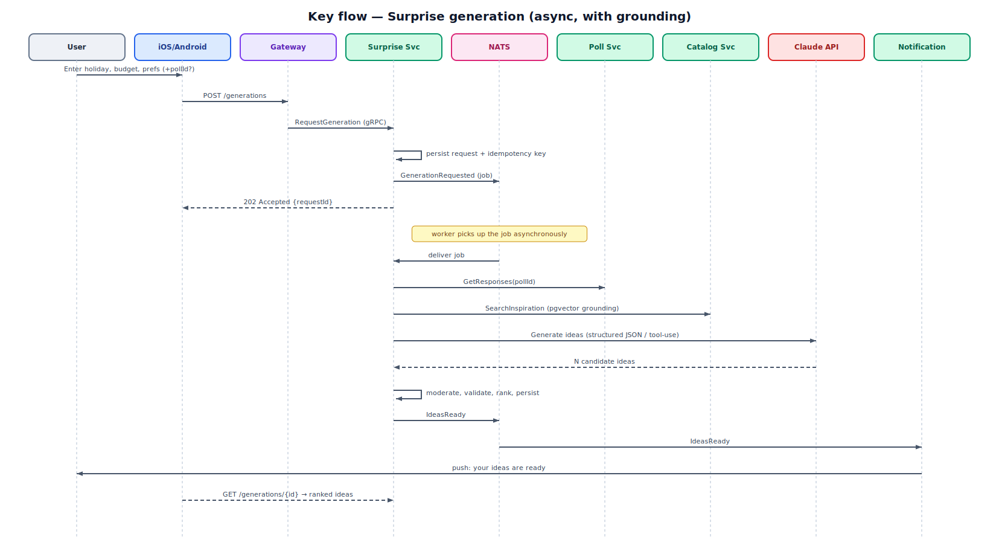
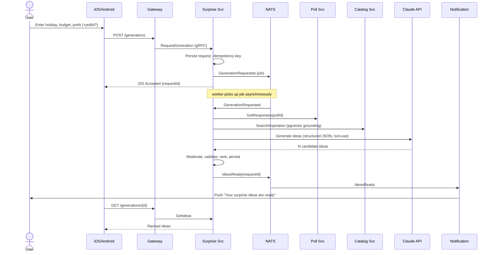
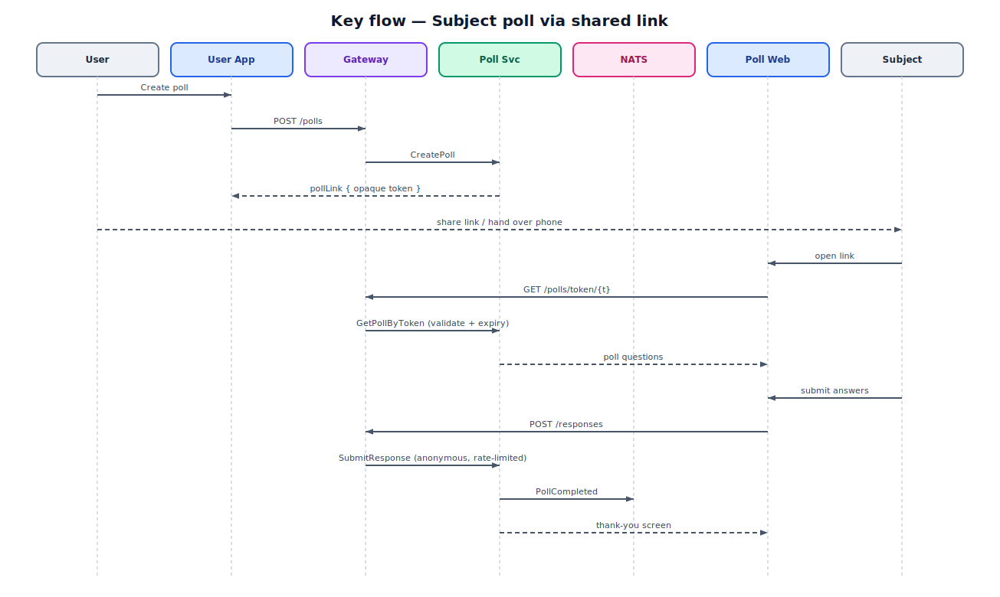
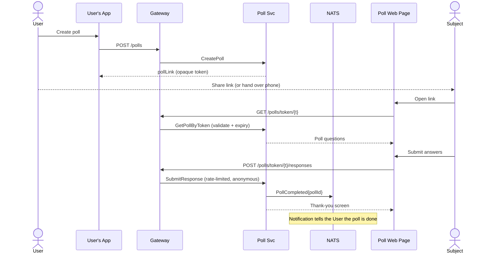

# PerfectGift — Architecture Design

## 1. Overview

**PerfectGift** is a mobile app that helps someone plan a *surprise* for their
partner — a date, a gift, a romantic evening — tailored to a holiday, a budget, and
free-form preferences. Its twist is a two-sided flow: the **User** (the planner)
describes the occasion, and the **Subject** (the partner) can secretly fill out a
short poll — reached by handing over the phone *or by opening a shared link* — whose
answers quietly sharpen the generated ideas. Clients are native iOS (SwiftUI) and
Android (Kotlin/Compose); the backend is a set of Go microservices.

The single hardest thing about building this is **the generation step**: turning
sparse, messy inputs (a holiday, a budget band, a paragraph of preferences, and an
optional poll) into *several genuinely good, budget-appropriate, non-generic* surprise
ideas — reliably, in a few seconds, at a controlled cost. That's an LLM
orchestration problem, and it drives most of the design decisions below.

## 2. Requirements & assumptions

### Core capabilities
- **Accounts & auth** for the User (mobile sign-in); **anonymous, link-scoped access**
  for the Subject (no account, ever).
- **Poll lifecycle:** create a poll, produce a shareable link / on-device handoff,
  let the Subject answer, capture responses.
- **Surprise generation:** take User inputs (+ optional poll answers) and generate
  **multiple** ranked ideas with enough detail to act on (what, why it fits, rough
  cost, how to pull it off).
- **Save / revisit** generated ideas; regenerate or refine.
- **Reference data:** holidays, categories, curated inspiration used to *ground* the
  generator so ideas aren't generic.
- **Notifications:** tell the User when the Subject finished the poll and when ideas
  are ready.

### Non-functional forces
- **Scale (assumed):** consumer app, seasonal spikes around holidays (Valentine's,
  anniversaries). Plan for ~10k–100k users, low thousands of generations/day at
  launch, bursty. Not Google-scale — right-size accordingly.
- **Latency:** UI interactions < 300 ms; **generation is inherently slow** (~3–15 s
  for an LLM). This must be an **async job**, not a blocking request.
- **Cost:** every generation is a paid LLM call. Cost control (caching, model
  selection, rate limiting) is a first-class concern, not an afterthought.
- **Consistency:** accounts, polls, and saved ideas need durable, transactional
  storage. Generated ideas are regenerable; eventual consistency is fine for
  notification/derived state.
- **Privacy/sensitivity:** the Subject's poll answers are personal. They're tied to a
  link the User controls, must expire, and must never leak across polls. Free-form
  text needs light content moderation.
- **Team/timeline (assumed):** small team, Go house style (gRPC internal +
  HTTP/Swagger edge, Postgres, Valkey). Wants microservices.

### Assumptions (correct me if wrong)
1. ~10k–100k users, thousands of generations/day, holiday-bursty — not millions.
2. A shared **link** is opened in a **mobile browser** by the Subject (they likely
   don't have the app), so a lightweight **web poll page** is required in addition to
   the native apps. Handing over the phone uses the native app.
3. Generation is powered by an **LLM (Anthropic Claude)**; there is no
   human-curated-only mode.
4. Eventual consistency is acceptable for "ideas ready" / notification propagation.
5. Payments/monetization are **out of scope for v1** (freemium later — noted in §12).
6. English first; i18n is a later concern.

## 3. Architecture overview

**Decision: microservices — five backend services behind an API gateway, plus an
async job/event bus.** The user asked for microservices, and here the boundaries are
real rather than cosmetic:

- **Identity** is isolated for security blast-radius and because *every* service
  depends on it — it's the natural shared, independently-hardened context.
- **Poll** has a fundamentally different access model from everything else: an
  **anonymous, public, link-scoped** surface. Keeping it separate means the public
  attack surface (unauthenticated submissions from the open internet) is contained
  and can be scaled/rate-limited on its own.
- **Surprise (generation)** is the one component that is slow, expensive, calls a
  third-party API, and scales on a different axis (LLM concurrency and cost, not web
  RPS). Isolating it protects the rest of the system from LLM latency, rate limits,
  and outages, and lets it scale/queue independently.
- **Catalog** is read-heavy, editorially-managed reference data with a totally
  different write pattern (rare admin writes, massive read cache hits). It also holds
  the grounding corpus for generation.
- **Notification** is async fan-out to APNs/FCM with retries — classic worker
  boundary that shouldn't sit in a request path.

An honest caveat: for the *pure* traffic numbers, a **modular monolith** would ship
faster and be cheaper to operate. The justification for splitting here is (a) the
explicit requirement, (b) the genuinely different scaling/security profiles of
Poll and Surprise, and (c) keeping the LLM/third-party blast radius isolated. We do
**not** split further than this — no separate "user-profile" or "auth-token" service;
that would be inflation.

## 4. System diagram

> Solid arrows = synchronous gRPC/REST · pink = async events/jobs over NATS ·
> red = external calls (LLM, push). Each service's own data stores are noted inside
> its box (no cross-service database access). Object storage (S3/MinIO) for idea
> imagery is deferred to v1.1.

Mermaid source (for editing)

## 5. Services & responsibilities

| Service | Responsibility | Owns / data | Talks to |
|---|---|---|---|
| **API Gateway / BFF** | Edge: TLS, routing, authN check, request shaping for mobile, Swagger | — (stateless) | All services (gRPC), clients (HTTP) |
| **Identity** | User accounts, sign-in (Apple/Google/email), token issue & validation, sessions | `users`, `credentials`, `oauth_links`; sessions in Valkey | Gateway; issues JWTs everyone validates |
| **Poll** | Poll templates, shareable links/tokens, anonymous Subject responses | `polls`, `poll_links`, `poll_responses` | Emits `PollCompleted`; read by Surprise |
| **Surprise** | Orchestrate generation: accept request, enqueue job, call LLM with grounding, store & rank ideas, saves | `surprise_requests`, `generated_ideas`, `saved_ideas` (+ pgvector) | Anthropic API; reads Poll & Catalog; bus |
| **Catalog** | Reference data (holidays, categories) + curated grounding corpus for the generator | `holidays`, `categories`, `inspiration` (+ pgvector) | Read by Surprise & clients |
| **Notification** | Push fan-out (APNs/FCM), device registration, retries | `devices`, `notifications` (outbox) | Consumes bus; APNs/FCM |

### Identity Service
Single responsibility: *who the User is*. Sign in with Apple and Google (mobile-first)
plus email/password fallback. Issues short-lived **JWT access tokens** (validated
locally by every service via shared public key) and rotating **refresh tokens**
(sessions stored in Valkey for instant revocation). Owns nothing about surprises or
polls. Key ops: `SignIn`, `RefreshToken`, `Revoke`, `GetMe`, `ValidateToken` (gRPC,
used by the gateway).

### Poll Service
Owns the **anonymous, link-scoped** flow. A User creates a poll for a specific
surprise; the service mints a **signed, expiring link token** (opaque, stored hashed).
The Subject — via the web page or the handed-over phone — fetches the poll by token
and submits answers **without authenticating**. This is the only service exposed to
unauthenticated public traffic, so it owns its own aggressive rate limiting and abuse
controls (Valkey). On completion it emits `PollCompleted{pollId, requestId}`.
Key ops: `CreatePoll`, `GetPollByToken`, `SubmitResponse`, `GetResponses` (owner-only).

### Surprise Service
The heart of the product and the trickiest service. Flow: accept a generation request
(holiday, budget, free-form prefs, optional `pollId`) → persist it → **enqueue a job**
on the bus → a worker pulls poll answers (from Poll) and grounding snippets (from
Catalog via pgvector similarity) → build a structured prompt → call **Claude** with
**tool-use / structured JSON output** so ideas come back as typed objects → validate,
moderate, rank, persist `generated_ideas` → emit `IdeasReady`. Caches LLM responses
by a hash of normalized inputs to cut cost on repeats. Also owns save/favorite and
"regenerate/refine". Key ops: `RequestGeneration`, `GetGenerationStatus`, `GetIdeas`,
`SaveIdea`, `Refine`.

### Catalog Service
Read-mostly reference data: holidays (with dates/regions), gift/date categories, budget
bands, and a **curated inspiration corpus** (short, editorially-vetted idea seeds).
The corpus is embedded (pgvector) so the Surprise Service can pull the most relevant
grounding for each request — this is what keeps generated ideas concrete and
on-brand instead of generic LLM filler. Almost all reads are cache hits (Valkey);
writes are rare admin operations. Key ops: `ListHolidays`, `SearchInspiration`
(vector), `GetCategories`.

### Notification Service
Consumes `PollCompleted` and `IdeasReady`, resolves the target User's devices, and
pushes via **APNs/FCM** with retry/backoff (transactional outbox pattern so a push is
never lost or double-sent). Owns device-token registration. No synchronous callers.

## 6. Data & storage

Every service owns its own schema; **no cross-service DB access** — services read each
other's data only through gRPC/events. Storage is deliberately boring: Postgres +
Valkey covers almost everything, with pgvector added only where grounding needs it.

| Store | Type | Product (committed) | Holds | Why this / over what |
|---|---|---|---|---|
| Identity DB | Relational | **PostgreSQL** | users, credentials, oauth links | Transactional identity data, integrity-critical. Chosen over any NoSQL because it's small, relational, and security-sensitive. |
| Identity cache | KV/cache | **Valkey** | sessions, refresh tokens, login rate limits | Sub-ms lookups + TTLs + instant revocation. |
| Poll DB | Relational | **PostgreSQL** | polls, poll_links (hashed), responses | Structured, owner-scoped, needs integrity + expiry queries. |
| Poll cache | KV/cache | **Valkey** | token→poll resolution, anonymous rate limits | Hot public path; protects DB from link-spam. |
| Surprise DB | Relational + vector | **PostgreSQL + pgvector** | requests, generated_ideas, saves; embeddings for dedup/similarity | Transactional ledger of ideas *and* similarity search in one store — avoids a separate vector DB at this scale. Chosen over a dedicated vector DB (Pinecone/Weaviate) because volumes are modest and pgvector keeps ops simple. |
| Surprise cache | KV/cache | **Valkey** | job status, idempotency keys, **LLM response cache** | Cheap job-status polling + dedupes/short-circuits repeat generations to cut LLM cost. |
| Catalog DB | Relational + vector | **PostgreSQL + pgvector** | holidays, categories, curated inspiration + embeddings | Read-mostly reference + semantic grounding retrieval. |
| Catalog cache | KV/cache | **Valkey** | hot reference reads | Reference data changes rarely → cache aggressively. |
| Media (later) | Object storage | **S3 (MinIO in dev)** | generated/curated idea imagery | Never store blobs in Postgres — keep URL + metadata only. Deferred to v1.1. |
| Event/job bus | Stream + queue | **NATS JetStream** | GenerationRequested (job), PollCompleted, IdeasReady (events) | Go-native, does both durable work-queue *and* pub/sub with minimal ops. Chosen over **Kafka** (overkill at this volume) and **RabbitMQ** (fine, but NATS is lighter and one system for both patterns). Revisit Kafka only if we need replayable high-throughput event logs. |
| Generation engine | External LLM | **Anthropic Claude API** | — (stateless calls) | `claude-sonnet-5` as the default generation model (best quality/latency/cost balance); escalate to `claude-opus-4-8` for premium/"deep" generations, and use `claude-haiku-4-5` for cheap classification/moderation passes. Structured output via tool use. |

**Consistency stance:** Identity, Poll, and saved ideas are strongly consistent
(single-service Postgres transactions). Cross-service propagation (poll done → notify;
ideas ready → notify) is **eventually consistent** over the bus — acceptable because a
one-second delay on a push notification is invisible to users.

## 7. Communication & integration

- **Internal: gRPC**, service-to-service, request/response. Fast, typed, matches house
  style. Used for the gateway→service calls and Surprise→Poll/Catalog reads.
- **Async: NATS JetStream** for anything that shouldn't block a request:
  - `GenerationRequested` — a **durable work queue**; the Surprise worker pool pulls
    jobs so LLM latency/rate-limits never block the API.
  - `PollCompleted`, `IdeasReady` — **pub/sub events** consumed by Notification (and
    future analytics).
- **Edge: HTTP/JSON with Swagger/OpenAPI**, exposed by the **API Gateway/BFF**. The
  gateway terminates TLS, validates the JWT (calling Identity's public key), rate
  limits, and translates REST↔gRPC. Mobile clients speak plain REST/JSON — simplest
  for SwiftUI/Kotlin and easy to evolve.
- **Auth flow:** Identity issues JWTs; the gateway and every service validate them
  locally against Identity's rotating public key (no per-request call to Identity on
  the hot path). The **Subject path is unauthenticated** — the Poll Service validates
  the opaque link token itself and issues a narrowly-scoped, short-lived poll session
  in Valkey.
- **External:** Surprise → Anthropic over HTTPS (with retries, timeouts, and a
  circuit breaker); Notification → APNs/FCM.

## 8. Frontend

Three clients, one API.

- **iOS — SwiftUI**, MVVM, `async/await` + `URLSession` against the REST gateway. No
  local persistence (per the brief) beyond the Keychain for the auth token and
  in-memory view state. Generation is async, so the app **submits then observes**:
  poll `GetGenerationStatus` (or receive a push) and render ideas when ready, with a
  friendly progress state during the ~3–15 s wait.
- **Android — Kotlin + Jetpack Compose**, MVVM, Retrofit/OkHttp + Coroutines/Flow,
  DataStore only for the token. Same submit-then-observe pattern.
- **Poll Web Page — a tiny SPA** (Svelte or plain React, static, hosted on
  **S3 + CDN**). This exists because a shared *link* is opened in a browser by a
  Subject who probably doesn't have the app. It's intentionally minimal: fetch poll by
  token, render questions, submit — no accounts, no routing beyond the poll. Native
  apps use **universal/app links** so a link opens the app when installed, else falls
  back to this web page.

Rendering strategy: native apps are inherently client-rendered; the poll page is a
**static SPA** (no SEO need, no server rendering — it's a private, token-gated form),
which keeps hosting to a CDN bucket. State management is local/per-screen; there's no
shared global store worth the complexity.

## 9. Cross-cutting concerns

- **AuthN/Z:** JWT (Identity-issued) for Users, validated locally everywhere;
  opaque expiring tokens for anonymous Subjects; owner-scoped authorization checks in
  Poll and Surprise (a User only sees their own polls/ideas).
- **Content safety:** free-form preference text and generated ideas pass a cheap
  **moderation pass (Claude Haiku)** before storage/return, keeping output wholesome
  and blocking abuse of the free-text field.
- **Observability:** **OpenTelemetry** traces across gateway→services→LLM (so you can
  see where the 15 s goes), **Prometheus** metrics (RPS, generation latency, LLM
  cost/tokens per request, queue depth), **Grafana** dashboards, structured JSON logs
  to **Loki**. LLM cost-per-generation is a tracked business metric.
- **Deployment:** each service is a container; deploy to **managed Kubernetes**
  (GKE/EKS) for the seasonal autoscaling the Surprise worker needs. For the MVP,
  `docker-compose` locally and a small managed platform (Cloud Run / Fly.io) is a
  perfectly fine start — don't stand up k8s before traffic justifies it. Postgres and
  Valkey as managed services (Cloud SQL / ElastiCache-compatible).
- **Secrets & config:** LLM keys, APNs/FCM keys, DB creds in a secrets manager; per-
  service config via env.
- **Resilience:** circuit breaker + retry/backoff around the LLM; idempotency keys on
  generation; transactional outbox for notifications.

## 10. Key flows

### Generation (async, with grounding)

Mermaid source (for editing)

### Subject poll via shared link

Mermaid source (for editing)

## 11. Trade-offs, risks & alternatives considered

- **Microservices vs modular monolith.** For the raw traffic, a modular monolith would
  be cheaper and faster to ship. We chose services per the requirement and because
  Poll (public/anonymous), Surprise (slow/expensive/third-party), and Identity
  (security) genuinely warrant isolation. **Risk:** operational overhead for a small
  team. **Mitigation:** keep it to five services, one bus, boring storage; the module
  boundaries are clean enough to *start* as a monolith and split if the team is tiny.
- **LLM dependency is the biggest risk.** Quality, latency, cost, and rate limits are
  all outside our control. Mitigations: async jobs (never block the user), response
  caching, pgvector grounding for quality, model tiering (Haiku/Sonnet/Opus by need),
  circuit breaker + graceful "try again" UX, and per-user rate limits to cap cost.
- **Generation quality is the product.** If ideas feel generic, the app fails. The
  curated **grounding corpus** (Catalog + pgvector) is the main lever; it needs real
  editorial investment, not just a prompt. **Risk:** cold-start with a thin corpus.
- **Async UX cost.** Submit-then-wait is more complex than a blocking call on both
  clients. Accepted because a 15 s blocking request is a worse experience and fragile.
- **Anonymous poll surface** is the main security exposure. Contained by isolating Poll,
  opaque hashed expiring tokens, and aggressive anonymous rate limiting.
- **Rejected alternatives:** Kafka (overkill vs NATS at this volume); a dedicated
  vector DB (pgvector suffices); MongoDB for ideas (ideas are relational + need
  ranking/joins; Postgres JSONB covers any flex); a shared database across services
  (silently re-couples them); server-side rendering for the poll page (no SEO need).

## 12. Build order

**MVP slice (prove the core loop, thin services):**
1. **Identity** — Sign in with Apple/Google + JWT. Gateway with auth + Swagger.
2. **Surprise (sync-ish first)** — `RequestGeneration` calling Claude with a
   hand-written prompt and a small hardcoded grounding set; return ideas. Get the
   *quality* right before adding machinery.
3. **iOS or Android app** (pick one) — input screen → ideas screen.
4. Turn generation **async** (NATS job + status polling) once the flow works.

**Then, in order:**
5. **Poll Service + web poll page** — the differentiating two-sided feature.
6. **Catalog + pgvector grounding** — replace hardcoded seeds with a real curated
   corpus and semantic retrieval (the main quality lever).
7. **Notification Service** — push for "poll done" / "ideas ready".
8. Second mobile client; save/favorite; refine/regenerate.
9. Moderation pass, observability dashboards, cost metrics.

**Where it changes under load:**
- Holiday spikes → autoscale the **Surprise worker pool** and Poll (public reads);
  lean harder on the LLM response cache and per-user rate limits.
- Idea imagery → add **S3 + CDN** (already provisioned in the design).
- Corpus growth or multi-tenant analytics → consider ClickHouse for event analytics
  and, only if vector volume explodes, a dedicated vector store.
- Monetization (freemium: N free generations, then paid) → a small **Billing**
  service and entitlement checks at the gateway — a clean future boundary, not built
  now.

---

*Stack summary: iOS SwiftUI · Android Kotlin/Compose · static poll SPA (S3+CDN) ·
Go services (gRPC internal, HTTP/Swagger edge) · PostgreSQL (+pgvector) · Valkey ·
NATS JetStream · Anthropic Claude (Sonnet 5 default, Opus 4.8 premium, Haiku 4.5
moderation) · Kubernetes · OpenTelemetry/Prometheus/Grafana/Loki.*
